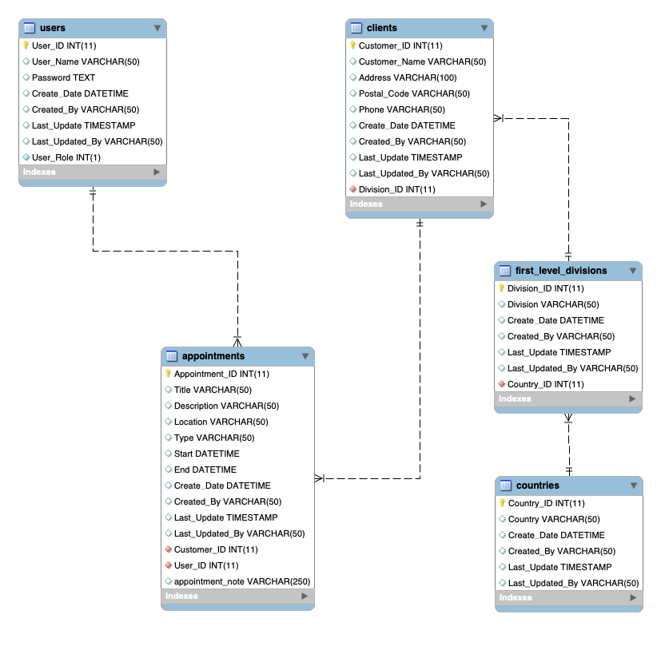
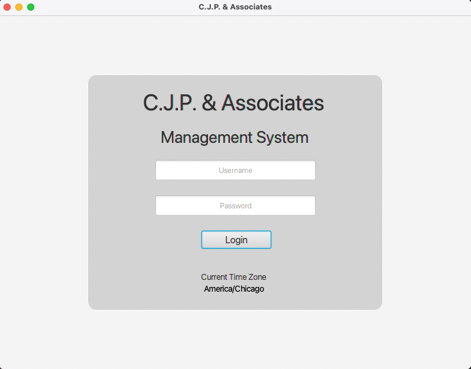
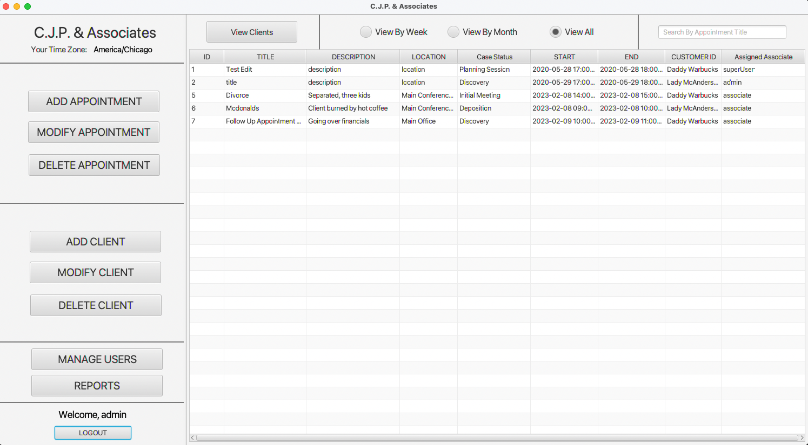
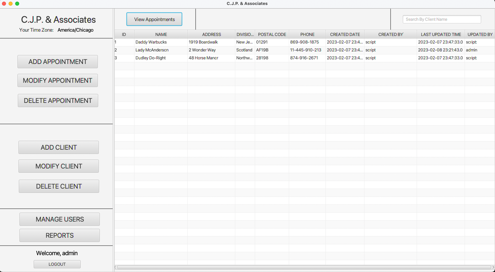
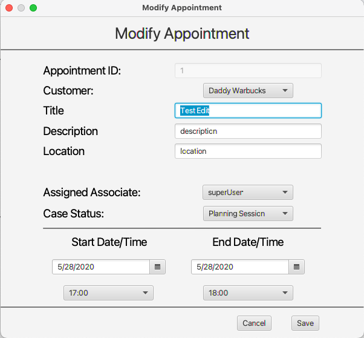
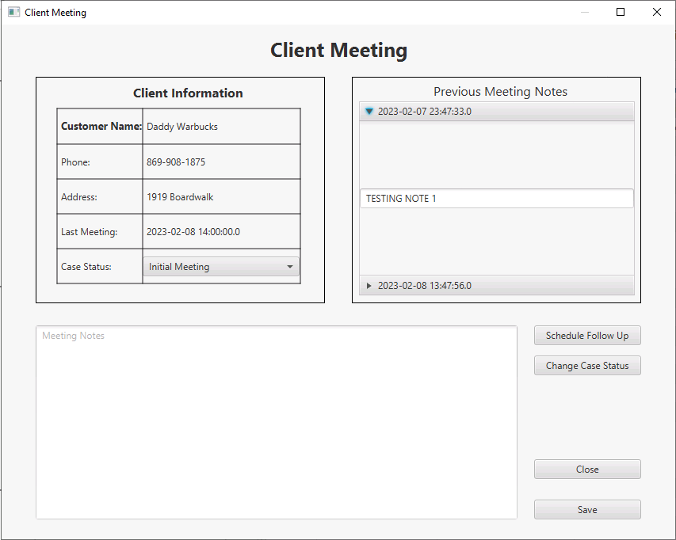

# Law Firm Management System

Desktop GUI application built using Java with connection to an Azure MySQL database using JDBC. This application is built for a ficticous law firm that was needing a digital solution to allow their business a way to store, access, and collaborate with the client data.


## Authors

- [@caymenp](https://www.github.com/caymenp)


## Tech Stack

- **Java** 
- **JavaFX**
- **MySQL Azure Database**
- **JDBC**
- **jpackage** (For packaging JAR file into executable download on windows/mac.)

## Features

- Executable desktop download
- Remote connection to Azure MySQL database.
- User authentication with username & password.
- User permissions/Access controls
- User management dashboard


## Run Locally

Download Link (GoogleDrive)

```bash
  Windows: https://drive.google.com/drive/folders/16_ur4xtqPLUyBgLRUTRnVOlgYaENEI6f?usp=share_link
```

```bash
  Mac: https://drive.google.com/drive/folders/1PeKYUkNDwu8OVu7AhChEF6I4cylsGrhZ?usp=share_link
```

Application Login Details

```bash
  Admin User: username: admin, password: admin
```

```bash
  Associate User: username: associate, password: associate
```


## Screenshots
**MySQL Database Design**


**Login Screen**


**Appointment Reminder Upon Login**


**Main Application Screen** (Showing Scheduled Appointments)


**Main Application Screen** (Showing Client Records)


**CRUD Form Example**


**User Management Dashboard** (User permissions 2 or 3 only)


**Client Meeting Dashboard** (Only accessible to assigned associate for client security)


